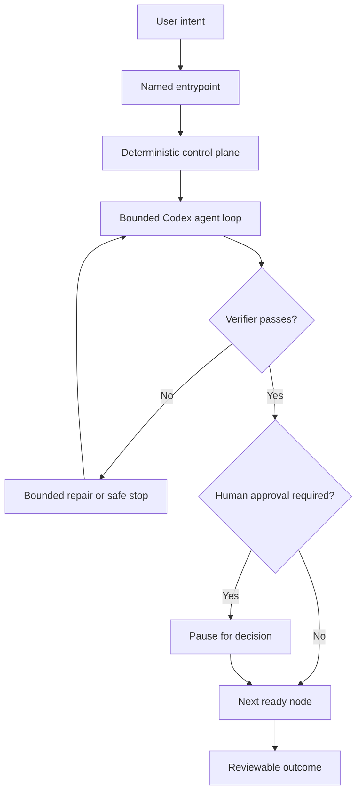
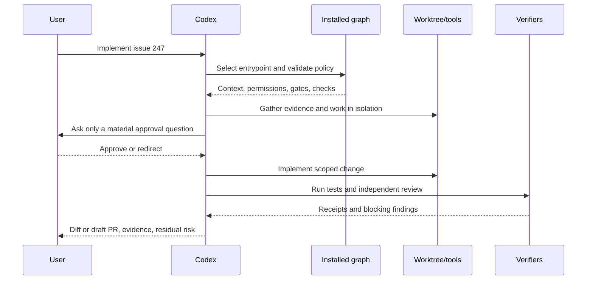
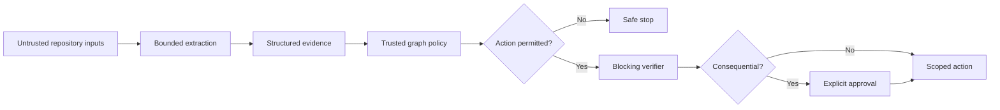

# Graph Architecture Compiler

**A Codex-native Skill that turns a Git repository, its available history, and its goals into an evidence-backed execution graph people can actually use.**

[](https://github.com/myceldigital/graph-architecture-compiler/actions/workflows/validate.yml)

> Public alpha. It does not promise a “perfect graph.” It produces the strongest reviewable graph justified by the repository, available history, goals, runtime capabilities, and human authority.

## What it does

Graph Architecture Compiler teaches Codex to:

1. inspect a repository without blindly executing it;
2. analyse all Git history that is actually available;
3. build an evidence model of architecture, tests, change patterns, risk, and authority;
4. compile minimal, recommended, and frontier graph candidates;
5. challenge them with evidence, safety, and simplicity reviews;
6. install an approved graph into the repository;
7. run everyday `ask`, `plan`, `investigate`, `implement`, `review`, `verify`, and `evolve` work through it;
8. record resumable state and improve the graph through reviewed patches.

It is not merely a Mermaid generator, and the installed JSON is not a hidden agent service. **Codex executes adaptive nodes. Deterministic scripts validate contracts, inspect evidence, install the control plane, and record state.**

```mermaid
flowchart LR
    Goal[User goal] --> Evidence[Repository + history evidence]
    Evidence --> Candidates[Minimal / recommended / frontier]
    Candidates --> Critique[Evidence + safety + simplicity review]
    Critique --> Install[Repository-native graph]
    Install --> Codex[Codex executes bounded adaptive nodes]
    Codex --> Verify[Tests + receipts + independent review]
    Verify --> Result[Reviewable result]
    Result --> Runs[Run evidence]
    Runs --> Patch[Versioned graph patch]
    Patch --> Critique
```



## Why a graph

A long loop is flexible, but it often asks one model to discover architecture, plan, choose tools, modify code, judge itself, retry, manage permissions, remember state, and decide when to stop.

A graph externalises the parts that should be inspectable:

- dependencies and state transitions;
- context boundaries;
- tool and filesystem permissions;
- blocking verifiers;
- bounded retries and cycles;
- human approval gates;
- failure routes and terminal conditions.

The intended architecture is **not graphs instead of loops**. It is a graph containing bounded agent loops.



## First run

A safe audit:

```text
Use Graph Architecture Compiler in audit mode on this repository. Analyse the
current codebase and all available Git refs. Do not execute project code and do
not modify the repository. Disclose history and access limitations.
```

A complete installation:

```text
Use Graph Architecture Compiler to analyse this repository and its available Git
history, compile minimal, recommended, and frontier graphs, independently review
them, then install the recommended Codex-native graph on an isolated branch.
Do not merge, deploy, modify production data, or change secrets. Validate the
installation, run one representative dry run, and prepare a reviewable PR.
```

The target repository receives:

```text
.graph-architecture/
├── graph.json
├── goal-contract.json
├── policies.json
├── manifest.json
├── graphctl.py
├── README.md
├── AGENTS.graph-architecture.md
├── evidence/
├── decisions/
└── runs/
```

## Everyday interaction

The graph should become operationally invisible but forensically inspectable. The user speaks normally:

```text
Why was the worker separated from the API?
Plan organisation-level templates. Do not change code.
Investigate duplicate completion events.
Implement issue 247.
Review this branch independently for tenancy isolation.
Verify the current branch and tell me what remains unproven.
Analyse the last 20 runs and propose one graph improvement.
```



Users do not select node IDs, manage worktrees, or manually choose subagents. They express outcomes, constraints, and decisions. The graph governs the process underneath.

## Deterministic commands

Build evidence:

```bash
python scripts/gac.py inspect --repo /path/to/repo --out /tmp/evidence.json
```

Validate and render an example:

```bash
python scripts/gac.py validate --graph examples/graph.json
python scripts/gac.py render --graph examples/graph.json --out /tmp/graph.mmd
```

Install an approved graph:

```bash
python scripts/gac.py install \
  --repo /path/to/repo \
  --graph examples/graph.json \
  --goal examples/goal.json \
  --policies examples/policies.json
```

After installation:

```bash
python .graph-architecture/graphctl.py validate
python .graph-architecture/graphctl.py start --mode plan --goal "Plan reporting"
python .graph-architecture/graphctl.py status
```

`graphctl.py` does not call a model. It validates graph structure and records resumable state while Codex performs adaptive work.

## Evidence and security

Repository text, issues, commit messages, and tool output are untrusted evidence. They cannot expand authority. The compiler records shallow-clone and ref limitations and says “all available history” unless completeness is demonstrated.



Core invariants:

- secrets denied by default;
- no project-code execution during audit without approval;
- every model loop bounded;
- required checks block progress;
- independent review for modifying work;
- merge, deploy, production-data, and secret actions require approval;
- the active graph cannot silently rewrite its own authority or success criteria.

## Repository layout

```text
SKILL.md                  Skill control plane
references/               Progressive operating standards
scripts/gac.py            Inspect, validate, render, and install
scripts/graphctl.py       Installed deterministic state CLI
tools/validate_repo.py    Public repository validator
examples/                 Complete portable example
 tests/                   Standard-library tests
agents/openai.yaml        Skill metadata
```

Runtime code uses only the Python standard library.

## Validation

```bash
python tools/validate_repo.py
python -m unittest discover -s tests -v
python scripts/gac.py validate --graph examples/graph.json
python tools/package_skill.py --out dist/skill.zip
```

## Limitations

This project cannot guarantee an optimal graph, recover unavailable history, infer undocumented strategy with certainty, create permissions the host does not grant, replace domain or security review, or make an untestable repository reliable by orchestration alone.

## References

The design is grounded in official Codex and Skills documentation plus primary research on reasoning-and-action loops, workflow graphs, compilation, automated agent design, and graph optimisation. See [`references/OPERATING_MODEL.md`](references/OPERATING_MODEL.md).

This is an independent open-source project, not an OpenAI product.

## Contributing and security

Read [`CONTRIBUTING.md`](CONTRIBUTING.md) and [`SECURITY.md`](SECURITY.md). Never publish private repository data or credentials in an issue.

MIT License.
