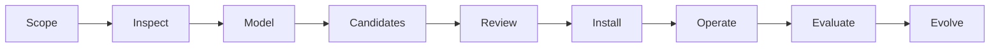

# Operating model and research basis

## Architecture

Graph Architecture Compiler separates:

- a reusable Skill that defines the method;
- repository evidence and a goal contract;
- a repository-specific execution graph;
- Codex as the adaptive runtime;
- deterministic scripts for inspection, validation, installation, rendering, and state;
- external controls such as Git permissions, sandboxes, CI, and human approval.

A graph is valuable only when it changes execution. Its nodes constrain context, permissions, outputs, checks, retries, failure handling, and approval. A Mermaid diagram without these contracts is documentation, not an operating graph.

## Lifecycle

1. Establish mission, user value, acceptance criteria, constraints, risk, and authority.
2. Determine repository and history coverage.
3. Build deterministic evidence before semantic interpretation.
4. Produce minimal, recommended, and frontier candidates.
5. Independently review evidence, safety, and simplicity.
6. Install the approved graph without overwriting existing project authority files.
7. Let Codex execute natural-language entrypoints.
8. Record evidence, decisions, failures, and interventions.
9. Propose reviewed graph patches rather than silent self-modification.

## Static and dynamic structure

Prefer a static safety envelope with dynamic task decomposition inside it. The graph may allow a planner to generate a task-specific subgraph, but a validator must constrain node types, permissions, cycle bounds, budgets, terminal conditions, and human gates.

Use deterministic nodes for known operations and bounded adaptive nodes only where judgement is genuinely required. Most graphs should contain code, retrieval, validation, tests, and human gates—not only persona agents.

## Research basis

The design draws on primary work including:

- ReAct, for interleaved reasoning and environmental action: <https://arxiv.org/abs/2210.03629>
- Reflexion, for bounded linguistic feedback and episodic memory: <https://arxiv.org/abs/2303.11366>
- Tree of Thoughts and Graph of Thoughts, for explicit search beyond a single reasoning chain: <https://arxiv.org/abs/2305.10601> and <https://arxiv.org/abs/2308.09687>
- LLMCompiler, for dependency-aware parallel tool execution: <https://arxiv.org/abs/2312.04511>
- GPTSwarm, Automated Design of Agentic Systems, and AFlow, for treating agent topology as an optimisation object: <https://arxiv.org/abs/2402.16823>, <https://arxiv.org/abs/2408.08435>, and <https://arxiv.org/abs/2410.10762>

These papers show useful mechanisms on studied tasks; they do not prove universal superiority. Benchmark gains must not be converted into unsupported promises for a new repository.

Official implementation context:

- Skills in ChatGPT: <https://help.openai.com/en/articles/20001066-skills-in-chatgpt>
- Introducing Codex: <https://openai.com/index/introducing-codex/>
- Introducing the Codex app: <https://openai.com/index/introducing-the-codex-app/>
- Codex security: <https://help.openai.com/en/articles/20001107-codex-security>

Host capabilities change. Detect them at runtime and preserve a sequential fallback.
